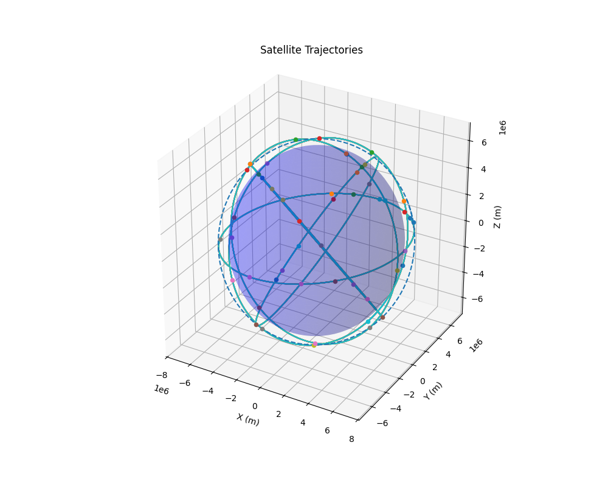
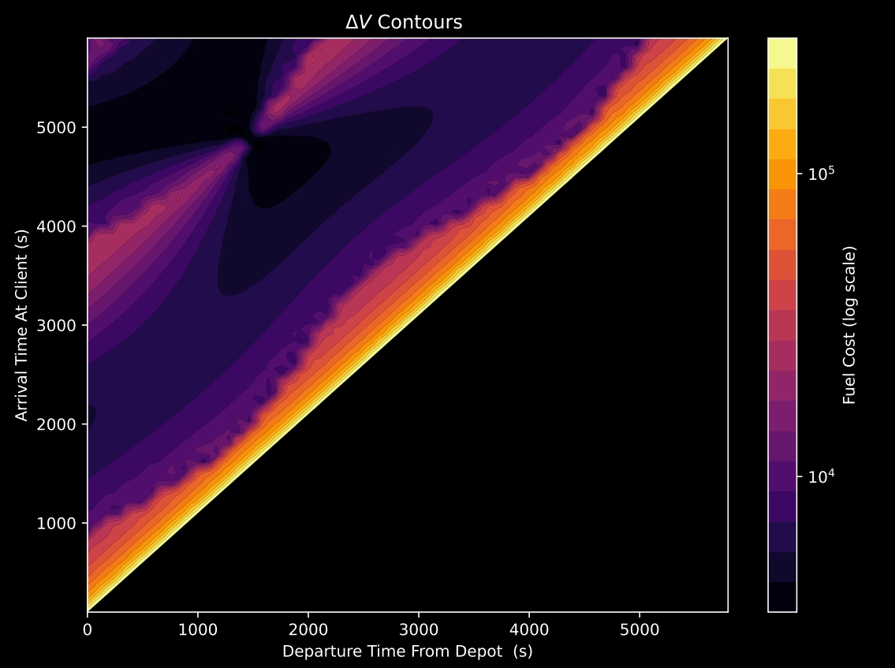

# NbodyWalkerDelta - On Orbit Servicing Toolkit

[](https://isocpp.org)
[](https://python.org)
[](LICENSE)
[](https://arma.sourceforge.net)

A comprehensive simulation toolkit for on-orbit servicing missions, integrating orbital mechanics, trajectory optimization, and advanced visualization capabilities.

## 🚀 Features

### Core Simulation
- **Walker Delta Constellations**: Generate and simulate satellite constellations with configurable parameters
- **N-body Dynamics**: Accurate orbital mechanics with J2 perturbations and mutual gravitational forces
- **Runge-Kutta Integration**: 4th-order numerical integration for precise trajectory propagation

### Trajectory Optimization
- **Lambert Solver**: High-precision orbital transfer calculations based on ESA's pykep library
- **Low-Thrust Analysis**: Analytical methods for continuous-thrust trajectory optimization
- **Multiple Optimization Algorithms**:
  - Local Search
  - Variable Neighborhood Search (VNS)
  - Tabu Search
  - Simulated Annealing
  - Dynamic Programming (Exact Methods)

### Advanced Visualization
- **3D Interactive Animation**: Real-time satellite position visualization
- **Transfer Trajectories**: Visual representation of satellite-to-satellite transfers
- **Interactive Controls**: Play/pause, speed control, time scrubbing
- **Configurable Display**: Filter satellites, adjust trails, customize colors

## 📋 Requirements

- **C++17** compatible compiler
- **CMake** 3.20 or higher
- **Armadillo** linear algebra library
- **Python 3.8+** (for visualization)

### Installation of Dependencies

**macOS (Homebrew):**
```bash
brew install armadillo cmake
```

**Ubuntu/Debian:**
```bash
sudo apt-get install libarmadillo-dev cmake
```

**General Armadillo Installation:**
Follow the instructions at: https://arma.sourceforge.net/download.html

## 🛠️ Installation

```bash
git clone https://github.com/nsushant/OOSToolkit.git
cd OOSToolkit

# Clean build
rm -rf build
mkdir build && cd build
cmake ..
make
```

## 🎯 Quick Start

### 1. Run Simulation
```bash
# From the build directory
./Nbody
```

This will generate output files in the `/data` directory:
1. Position, velocity, and time data for simulated satellites
2. All possible trajectories for a given schedule

### 2. Visualize Results
```bash
# Navigate to root directory and activate visualization environment
source .venv/bin/activate

# Animate all satellites
./visualize_satellites.py data/WalkerDelta.csv

# Show specific satellites only
./visualize_satellites.py data/WalkerDelta.csv --satellites sat_0 sat_3 service_1

# Visualize transfer trajectory
./visualize_satellites.py data/WalkerDelta.csv --transfer sat_0 sat_3 1000 5000

# Interactive controls during animation:
# Space: Play/Pause  |  ←/→: Step through time
# +/-: Adjust speed   |  Q: Quit
```

## 📚 Documentation

- **[Complete API Documentation](docs.md)**: Detailed function reference and data structures
- **[Visualization Guide](Plotting_scripts/README_visualization.md)**: Advanced visualization features and usage

## 🏗️ Architecture

```
NbodyWalkerDelta/
├── include/                    # Header files
│   ├── Nbody.hpp              # Core orbital mechanics
│   ├── LambertSolver.hpp       # Lambert problem solver
│   ├── LowThrustAnalytical.hpp # Low-thrust optimization
│   ├── Trajectory_selection.hpp # Optimal trajectory selection
│   ├── Local_search.hpp       # Local search algorithms
│   ├── VNS.hpp                # Variable neighborhood search
│   ├── Tabu_search.hpp        # Tabu search implementation
│   ├── Simulated_Annealing.hpp # Simulated annealing
│   ├── Exact_methods.hpp      # Dynamic programming
│   └── data_access_lib.hpp    # CSV data handling
├── src/                       # Implementation files
├── Plotting_scripts/          # Visualization tools
│   ├── visualize_satellites.py
│   └── README_visualization.md
├── CMakeLists.txt            # Build configuration
├── docs.md                   # API documentation
└── README.md                 # This file
```

## 🔬 Key Components

### 1. Orbital Mechanics
- **Units**: meters, seconds, kilograms
- **Coordinate System**: ECI (Earth-Centered Inertial)
- **Integration**: 4th-order Runge-Kutta
- **Perturbations**: J2, mutual gravitation

### 2. Lambert Solver
Based on ESA's pykep library with corrections from D.Izzo's "Revisiting Lambert's Problem":
- High-precision orbital transfer calculations
- Support for multiple revolutions
- Prograde and retrograde solutions

### 3. Optimization Algorithms
Multiple approaches for trajectory and schedule optimization:
- **Local Search**: Gradient-based optimization with neighborhood moves
- **VNS**: Variable neighborhood search for global optimization
- **Tabu Search**: Memory-based search avoiding local optima
- **Simulated Annealing**: Probabilistic optimization with cooling schedule
- **Dynamic Programming**: Exact solutions for combinatorial problems

## 🎮 Examples

### Basic Constellation Analysis
```cpp
#include "Nbody.hpp"

// Create Walker Delta constellation
std::vector<satellite_object> constellation = build_walker_constellation(
    3,                      // Number of orbital planes
    24,                     // Total satellites
    1,                      // Relative spacing
    500000,                 // Altitude (meters)
    deg_to_rads(53),        // Inclination (radians)
    100                     // Satellite mass (kg)
);

// Run simulation for 1 day
run_simulation("output.csv", "walker_delta", 86400, 10, 500000, 3, 24, 1, deg_to_rads(53));
```

### Orbital Transfer Calculation
```cpp
#include "LambertSolver.hpp"

// Define positions (ECI frame, meters)
arma::vec3 r1 = {7000e3, 0, 0};      // Initial position
arma::vec3 r2 = {0, 7000e3, 0};      // Final position
double tof = 3600;                   // Time of flight (seconds)

// Solve Lambert's problem
std::vector<arma::vec> solutions = lambert_solver(r1, r2, tof, MU_EARTH, 1, 0);
arma::vec3 v1 = get_v1(solutions, 0); // Initial velocity
arma::vec3 v2 = get_v2(solutions, 0); // Final velocity
```

### Schedule Optimization
```cpp
#include "Local_search.hpp"
#include "data_access_lib.hpp"

// Load simulation data
DataFrame simfile("simulation_data.csv");

// Create and optimize schedule
schedule_struct schedule = create_schedule_lambert_only(
    deltaV_of_schedule_init, arrival_times, departure_times, satnames, simfile
);

schedule_struct optimized = local_search_opt_schedule_lambert_only(
    init_deltaV, schedule, dt_move, simfile, service_time, move_methods
);
```

## 📈 Visualizations

The toolkit provides comprehensive visualization capabilities:

<div style="display: flex; justify-content: space-around;">
  
  
</div>

<p style="text-align: center; margin-top: 10px;">
    <strong>Figure 1:</strong> Example visualizations. Left panel shows satellite trajectories in 3D, right panel displays Delta-V contours showing fuel consumption for transfer trajectories between satellites.
</p>

### Visualization Features
- **Real-time 3D animation** of satellite positions
- **Interactive trajectory planning** with Lambert transfer visualization
- **Delta-V analysis** with contour plots for fuel optimization
- **Multi-satellite tracking** with configurable filters

## 🔬 Use Cases

### Satellite Constellation Design
- Design optimal Walker Delta configurations
- Analyze coverage and spacing patterns
- Evaluate mission parameters

### Mission Planning
- Calculate optimal transfer trajectories
- Minimize fuel consumption with multiple algorithms
- Schedule satellite servicing missions

### Space Debris Analysis
- Track debris trajectories
- Plan collision avoidance maneuvers
- Simulate constellation behavior

### Research & Education
- Study orbital mechanics principles
- Visualize complex orbital dynamics
- Test optimization algorithms

## 🧪 Validation

The library has been validated against established benchmarks:
- **Lambert Solver**: Verified against ESA pykep library test cases
- **Orbital Propagation**: Confirmed with analytical Keplerian solutions
- **J2 Perturbations**: Tested against standard geopotential models

## 🤝 Contributing

1. Fork the repository
2. Create a feature branch (`git checkout -b feature/AmazingFeature`)
3. Commit your changes (`git commit -m 'Add some AmazingFeature'`)
4. Push to the branch (`git push origin feature/AmazingFeature`)
5. Open a Pull Request

## 📄 License

This project is licensed under the MIT License - see the [LICENSE](LICENSE) file for details.

## 🙏 Acknowledgments

- **ESA Advanced Concepts Team**: Lambert solver algorithm and pykep library
- **D. Izzo**: "Revisiting Lambert's Problem" publication
- **Armadillo**: High-performance linear algebra library
- **Conrad Stanislawski**: Contributions to orbital mechanics algorithms

## 📞 Support

For questions, bug reports, or feature requests:

- Create an [Issue](https://github.com/nsushant/OOSToolkit/issues)
- Check the [API Documentation](docs.md)
- Review the [Visualization Guide](Plotting_scripts/README_visualization.md)

---

**Author**: S. Nigudkar (2025)  
**Version**: 1.0.0  
**Last Updated**: January 2025